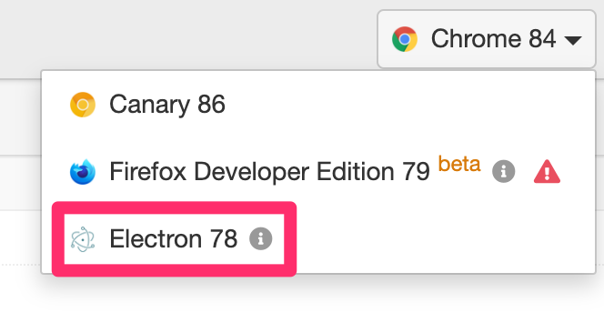

# Running apps with Cypress

There are a number of reasons that we want to use Cypress in our development workflow:

-   We can write e2e UI tests that can let us **test out our changes**
-   We can shield ourselves from **API and environment-related** changes by **mocking any and all network calls**
-   We can recognize when our changes for one flow make **unexpected changes to other flows**
-   We can **make refactors possible** by making sure that these tests still pass
-   We can capture the expected behavior of our application

## Running the tests

The following command brings up the cypress menu for de-care:

```
npm start cypress.de-care
```

The following image describes the various sections:


For Windows users, the "Electron" browser should be used to get around the security policy with Chrome. Electron uses Chromium under the hood, so the results should match closely with Chrome.



A sample run is shown below


